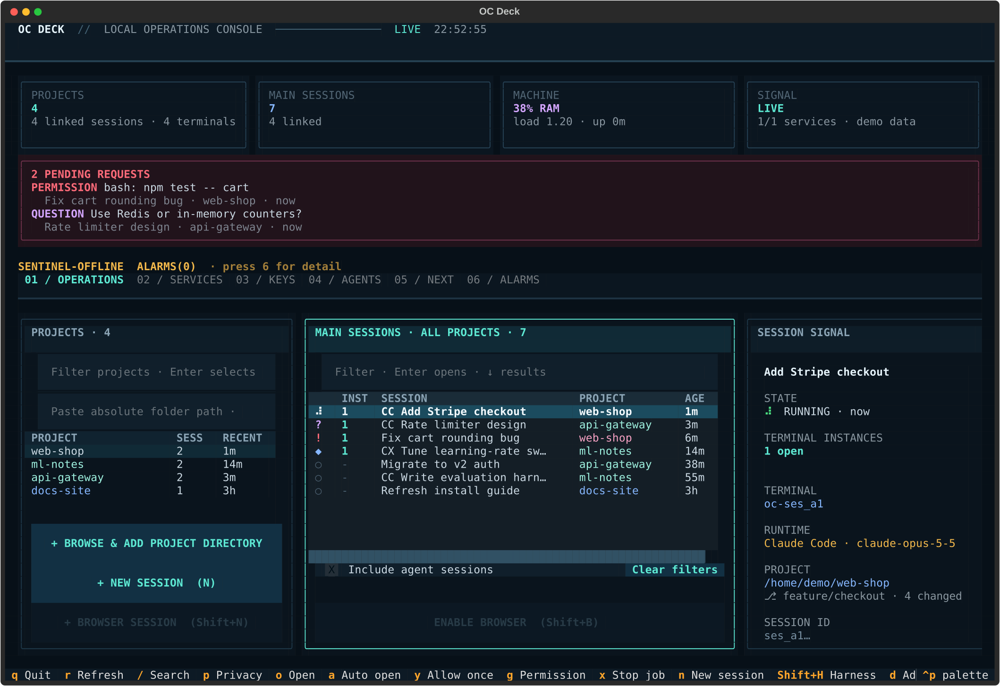
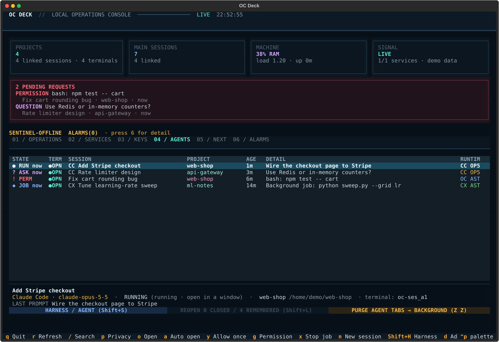

# OC Deck

A terminal operations console for AI coding agents. One screen shows every
project, every agent session and what each needs from you — across
**OpenCode**, **Claude Code** and **Codex** — and one keystroke jumps into the
right terminal.

- **See everything at once.** Sessions grouped by project, with live state:
  running, waiting for a permission, asking a question, stalled, idle or closed.
  Nested helper agents are folded under their parent.
- **Act without leaving the keyboard.** Approve a pending permission (`y`), jump
  to a session (`Enter`), start or resume one in the harness you choose
  (`Shift+S`), hand work from one harness to another (`Shift+C`), close what
  you're done with (`x`).
- **Background jobs stay visible.** On OpenCode V2, a session whose turn ended but
  whose shell command is still running shows `◆ JOB`, not IDLE.
- **Sentinel.** A read-only health layer where harnesses watch each other:
  stalled sessions, missing approvals, drift, with privacy-redacted alarms.
- **Shared memory.** `ocdeck-index` is an MCP server every harness can use for a
  project-wide index and notes, one memory per project across all agents.
- **Built to be safe.** It reads session stores and the OpenCode API; it never
  approves anything on its own, scrubs secrets from the environment of the
  processes it starts, and treats every file it reads as untrusted input.



*The operations view. Every screenshot here is generated from made-up demo data (`scripts/make_screenshots.py`), not from real sessions.*

> **Status: 0.1, first public release.** It has been used daily by its author
> on Ubuntu with GNOME on Wayland. The terminal app should work anywhere Python
> and tmux do; the desktop integration is GNOME-only. Expect rough edges and
> please [report them](https://github.com/omkarchandra/ocdeck/issues).

## Requirements

- Linux (developed on Ubuntu; macOS may work for the terminal app but is untested)
- Python 3.12 or newer (tested on 3.12 and 3.14)
- `tmux`
- At least one agent CLI: [OpenCode](https://opencode.ai), Claude Code or Codex
- Optional: GNOME Shell on Wayland with Ptyxis for the [desktop integration](desktop/README.md)
- Optional: Node 22+ for the [plugins](plugins/README.md)

## Install

```sh
git clone https://github.com/omkarchandra/ocdeck.git
cd ocdeck
./install.sh            # the terminal app only
./install.sh --desktop  # plus the GNOME hotkey, top-bar button and notification focus
```

`install.sh` creates a virtualenv in `.venv`, installs OC Deck into it and links
`ocdeck` and a few helper commands into `~/.local/bin` (make sure that is on your
`PATH`). It refuses to overwrite a launcher it did not create. Pass `v1` or `v2`
to choose the OpenCode generation to talk to (default `v2`).

Or without the installer: `pip install -e .` in a virtualenv, then run `ocdeck`.

## Run

```sh
ocdeck               # the interactive dashboard
ocdeck --once        # print one report and exit (good for scripts and a first check)
```



Press `3` inside the deck for the full key reference. The essentials:

| Key | Action |
|---|---|
| `1`–`6` | Views: operations, services, keys, live agents, portfolio, sentinel |
| `↑ ↓` / `j k` | Move through rows |
| `Enter` / `o` | Attach to the selected session's terminal |
| `n` | New session in the selected project |
| `Shift+S` | Pick harness and agent/profile, then start fresh or continue with handoff notes |
| `y` | Approve the selected pending permission once |
| `x` (twice) | Close the selected session's terminal; history is kept |
| `/` | Search all sessions |
| `q` | Quit |

## Which agents does it show?

Each harness is optional, OpenCode included. By default a harness is on when
its CLI is installed. To change that, edit `~/.config/ocdeck/harnesses.json`
(`{"opencode": "auto", "claude": "off", "codex": "auto"}`), use
`ocdeck-hub harness off claude`, or pass `ocdeck --harness claude,codex` for one
run.

## What is in this repository

| Folder | What | Needed? |
|---|---|---|
| `src/ocdeck/`, `tests/` | The dashboard and its test suite | yes |
| [`desktop/`](desktop/README.md) | GNOME extensions: Super+O, top-bar button, click-a-notification-to-focus, window placement | optional |
| [`plugins/`](plugins/README.md) | OpenCode plugins for permission notifications and a fast read bridge | optional |
| [`agent-browser/`](agent-browser/README.md) | A separate persistent Chrome that agents drive, with your logins | optional |
| [`home-agent/`](home-agent/README.md) | The contract for a project orchestrator you can build yourself | optional |
| [`docs/reference.md`](docs/reference.md) | The detailed reference: every key, view, setting and data source | |

Anything optional you do not install simply does not appear. With nothing but
the dashboard, you get the sessions, the agents board, sentinel and the keys above.

## Development

```sh
python -m venv .venv && .venv/bin/pip install -e '.[dev]'
.venv/bin/python -m pytest -q tests         # takes about ten minutes
node --test plugins/test_permission_notify.mjs desktop/tests/*.mjs tests/*.mjs
```

See [CONTRIBUTING.md](CONTRIBUTING.md). Security reports: [SECURITY.md](SECURITY.md).
Changes: [CHANGELOG.md](CHANGELOG.md).

## License

[MIT](LICENSE).
